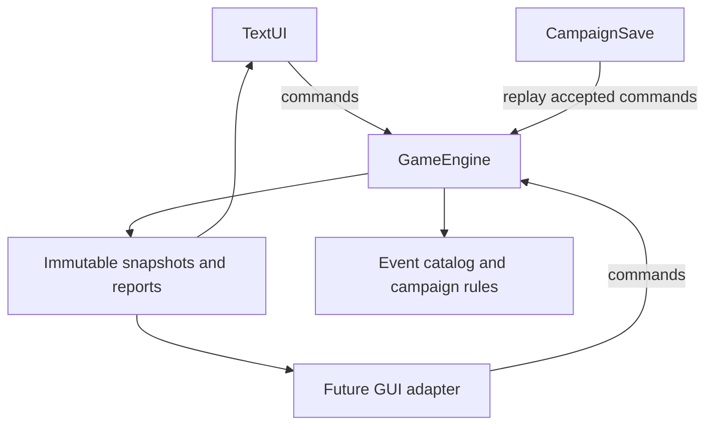

# Engine and interface architecture

## The future GUI contract

A presentation layer creates a `GameEngine`, reads `view()`, and submits `GameCommand` objects. It must not infer the result of an action or mutate game state itself.

```java
GameEngine game = new GameEngine(
    42L, President.Difficulty.NORMAL,
    President.RunningMate.COMMUNITY_ORGANIZER);

GameView initial = game.view();
// Render state cards using initial.states(). Use each ActionView's availability and price.
TurnReport report = game.submit(GameCommand.fundraise());
// Render report.messages(), then render report.view().
if (report.view().pendingEvent() != null) {
    // Render its choices. The UI supplies the player's chosen zero-based index:
    // game.submit(GameCommand.respond(selectedIndex));
}
```

`view()` is a pure read: calling it repeatedly never consumes random draws. Snapshots copy their nested collections. A rejected command returns an explanation and an unchanged snapshot; it never spends cash, consumes a turn, or draws an event.

`GameEngine` is designed for one controller thread per game session. It is not thread-safe. A future Swing, JavaFX, or web adapter should serialize commands, then render snapshots on its UI thread. Engine code does not import Swing, print to the console, or read input. Save I/O is also separate.



## Responsibilities

| File | Responsibility |
|---|---|
| `PresidentialSimulator.java` | Parse launch options and start the text adapter |
| `TextUI.java` | Guided menus, wrapping, paging, search, confirmation, recaps, save error handling |
| `GameEngine.java` | Validate commands, advance turns, opponent behavior, event selection/effects, ownership, final result |
| `GameCommand.java` | Typed campaign/fundraise/pass/response commands |
| `GameView.java` | Immutable dashboard, state/action cards, temporary effects, event choices, history |
| `TurnReport.java` | Acceptance flag, messages, and post-command snapshot |
| `CampaignEvent.java` | Immutable event, option, and effect definitions |
| `EventCatalog.java` | The 36 authored events; no console dependencies |
| `CampaignSave.java` | Versioned properties save, atomic replacement where supported, validated replay |
| `President.java` | Internal cash and completed-task storage for one campaign |
| `State.java` | Immutable scenario card and objective types |
| `ElectoralCollege.java` | Scenario roster, supplied EV values, seeded objective assignment |
| `ElectionResult.java` | Immutable validated final tally and explanations |
| `ElectionGUI.java` | Optional Swing results viewer; not the campaign controller |

## Turn ordering

For an accepted normal action:

1. Validate the command, required objective, duplicate status, and current price.
2. Advance one turn and apply the player's action.
3. On even-numbered turns, run one opponent action.
4. Select one unused eligible event, then select an eligible target when required.
5. Apply immediate effects or expose a pending response.
6. Report any changes in state ownership and append the command to the replay journal.
7. Finalize only after turn 16 and any pending response are complete.

Responses are commands too. They validate affordability before any effects are applied, apply the whole response, and use no extra turn. The text adapter saves after every accepted command, including the command that created a pending event.

## Opponent controller

The opponent keeps its own funds and completed objectives. After every second turn, it considers states that currently belong to the player or where the player has begun work. It prioritizes its existing unfinished projects, then chooses a seeded random eligible state. It takes the cheapest missing objective there, or fundraises if it cannot afford it. This is deliberately a small game controller, not a real campaign strategy model.

This logic lives in `opponentTurn()` and can later be extracted behind an interface. Both sides' actions use the same price modifiers and completed-objective rules.

## Event extension

An event has a stable ID, title, description, category, and either immediate effects or response options. All definitions are immutable.

Supported effects:

| Kind | Meaning |
|---|---|
| `FUNDS` | Add/subtract fictional cash; mandatory losses clamp at available cash |
| `COMPLETE_TASK` | Complete one required objective in a randomly selected eligible state |
| `REMOVE_TASK` | Reopen one completed objective in a randomly selected eligible state |
| `ACTION_COST` | Modify one action type's price for a stated number of upcoming turns |
| `FUNDRAISING` | Modify proceeds from fundraising actions for upcoming turns |

Targets are `PLAYER`, `OPPONENT`, or `BOTH`. Task effects require a single side; shared cash and temporary effects can use `BOTH`. Opponent events are automatic. Interactive response cards belong to the player, including one choice that affects both campaigns.

To add an event, add one definition to `EventCatalog.all()` with a unique ID. Reuse an existing effect kind when possible. A new mechanical effect requires changes to the effect enum/validation, engine eligibility/application, UI descriptions if needed, and tests. The catalog is Java data, not an external JSON modding API.

Event selection filters for eligibility before drawing. It does not repeatedly draw inapplicable cards until one works, and viewing a menu cannot reroll anything. Reopened objectives always refer to work that actually exists. A paid response with no matching state is never offered.

## Determinism and save compatibility

Three separate seeded random streams govern scenario objectives, event selection/targets, and opponent choices. The accepted-command journal reproduces the complete session. Saving at a pending event does not resolve or redraw it.

Saves use Java `Properties`, not Java object serialization. Files have a size limit; the format ID, enum values, command count, and every replayed command are checked. Writes use a temporary sibling file and atomic move where available, with a replace fallback.

**Change `CampaignSave.FORMAT` when altering gameplay rules, catalog order/content, random draw order, or replay semantics.** Otherwise old journals can reproduce a different session under new rules. There is no automatic migration layer or tamper-proof signing.

## Intentional boundaries

This is a reusable **Java engine**, not a network service or a finished campaign GUI. There is no multiplayer concurrency, HTTP API, external data integration, governing loop, or real-world political forecasting model. The supplied Swing viewer remains results-only. A GUI can now be added without copying campaign rules out of the terminal class.
