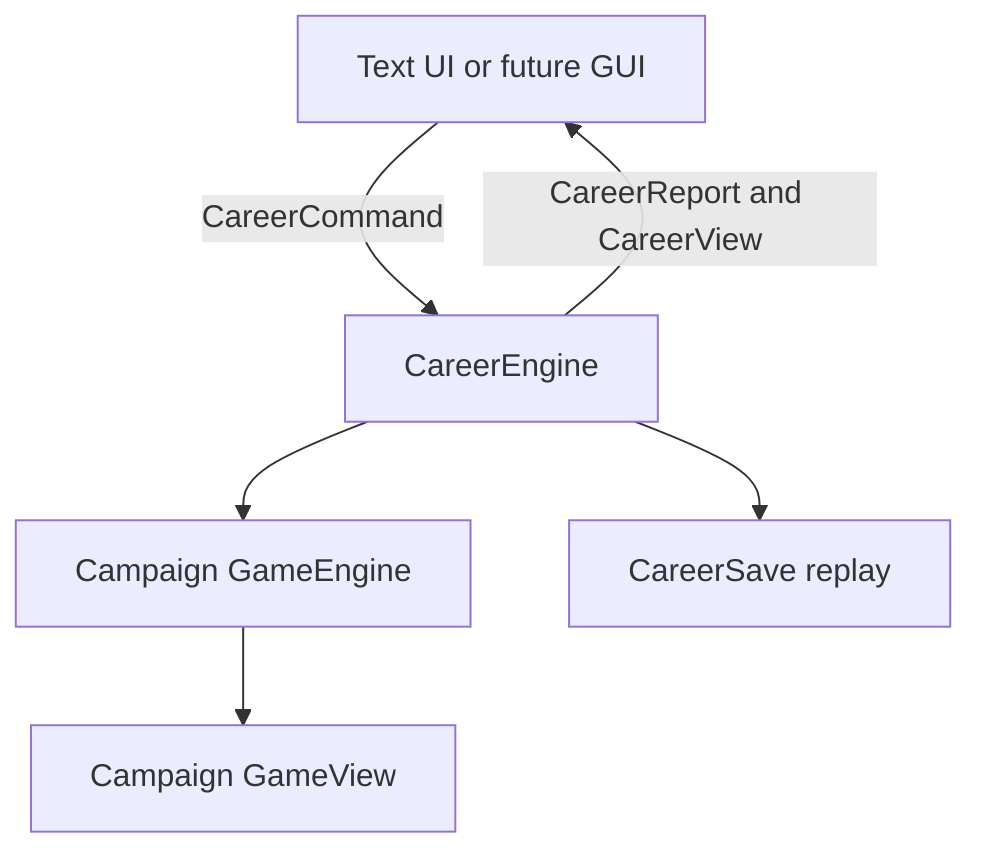

# Career architecture

## Core contract

`CareerEngine` is the controller for the continuing career. A text or graphical renderer sends a `CareerCommand` and receives a `CareerReport` containing messages plus an immutable `CareerView`.

The engine contains no console input, Swing rendering, or filesystem writes. `TextUI` handles display and input. `CareerSave` handles persistence. This keeps the future GUI from duplicating campaign, presidency, or comeback rules.

## Phases

| Phase | Entry | Main commands | Exit |
|---|---|---|---|
| `CAMPAIGN` | New career or `RUN_AGAIN` | campaign action, fundraise, pass, event response | Election review after turn 16 |
| `ELECTION_REVIEW` | Campaign result | continue, results, status | Transition after win; opposition after loss |
| `TRANSITION` | Winning review | continue, resources, status | Presidency |
| `PRESIDENCY` | Transition or developer scenario | governance action, status, menu | Term review or retired |
| `TERM_REVIEW` | Four-year term | run again, retire, status | New campaign or retired |
| `OPPOSITION` | Lost election | rebuild year, status, run again after four years | New campaign or retired |
| `RETIRED` | Voluntary retirement or two wins | status, journal, title | New career from title |

A phase gate rejects commands that do not make sense in the current phase. Rejected commands do not enter the career journal or alter any model state.

## Commands

`CareerCommand` groups typed mutations:

- `CAMPAIGN(GameCommand)`: passes campaign actions or event responses to the embedded `GameEngine`.
- `CONTINUE`: moves from election review to transition/opposition, or from transition to office.
- `GOVERN(GovernanceAction)`: advances one presidential quarter.
- `REBUILD(RebuildAction)`: advances one out-of-office year.
- `RUN_AGAIN`: starts a new campaign only after a completed term or four-year comeback.
- `RETIRE`: ends the normal career.
- `DEVELOPER(DeveloperAction)`: invokes an explicitly marked testing shortcut.

`CareerView` carries phase/time fields, election history, reputation and feedback text, support text, treasury/economic conditions, transition and next-campaign effects, governance availability, and the embedded campaign view. Collections are immutable snapshots.

## Election consequences

A natural win records electoral votes, increments victories, and collects completed campaign tasks from states the player controls as one-use transition credits. Town-hall work supplies the first public-briefing credit; field-office work supplies cabinet coordination; outreach work supplies a service-review discount. The player then chooses to enter office.

A natural loss increments losses, retains the result, opens four opposition years, and sets two persistent needs:

- Donor meetings remove a $200 withholding from the next campaign's starting cash.
- Campaign review updates the public record and prepares one town-hall objective.
- Community work prepares one outreach objective.
- Private life advances the year without resolving those needs.

The player can run again after all four annual decisions. Losses remain in the election history and reputation text even after rebuilding.

A tie is recorded as `TIE`, neither a win nor a loss. This prototype does not simulate a contingent election.

## Presidency rules

Each term has 16 quarters. Every quarter automatically applies +$250 receipts and -$200 routine expenses, then applies the chosen action's cost. A budget review recovers one $100 duplicate payment per year. Work is stored in the current year's checklist. At each year boundary, final-year work is retained for the next campaign; non-final-year checklists reset for the new year.

A completed final-year briefing prepares one town-hall objective; cabinet coordination prepares one field-office objective; service review prepares one outreach objective. Final-year budget review prepares a fictional $100 private campaign benefit. The next campaign consumes those benefits once.

Campaign cash and treasury never share a field. The current economy display describes operating reserve and annual reconciliation status rather than claiming to model macroeconomic indicators.

## Developer tools

Developer actions are available through the Game Menu and are recorded in the career journal. `FORCE_WIN` and `FORCE_LOSS` create an election review without fabricating electoral votes. Timeline fixtures set a known term/quarter; `REELECTION_START` ends the current quarter and opens a campaign directly. Resource actions change only the selected campaign or treasury. `FINISH_TERM` calls normal routine governance repeatedly, preserving the same budget and term rules.

Developer shortcuts mark `developerUsed` in the view and save. They exist for deterministic testing and future GUI development. Scenario jumps intentionally replace the active timeline while retaining a development history entry.

## Persistence

`CareerSave` stores a version ID, setup, and every accepted career command. It reconstructs the career by replaying commands through the same engine. This includes the embedded campaign journal, event draws, opponent choices, active effects, pending event, quarterly records, comeback consequences, and developer state.

The loader checks size, format, enum values, command count, and phase-valid replay. It supports the prior `campaign-events-v1` save by importing its accepted campaign commands into a new career record. Unknown future formats are rejected. Writes use a temporary sibling file and atomic move when available.

## Extending the presidency

New presidency features should be represented as typed commands and immutable view fields. For example, a future scandal can be a governance action or event effect that changes approval/reputation and reelection conditions. A war or crisis can be a phase-specific event requiring a response. A dictator path should be an explicit alternative phase with its own eligibility, term-limit bypass rules, and consequences, rather than a hidden flag in ordinary governance.

Keep each new system's consequences inspectable on the status screen and replayable from the journal. Add tests for natural paths and developer fixtures together. Do not read or write state from `TextUI`; use `CareerEngine`.
