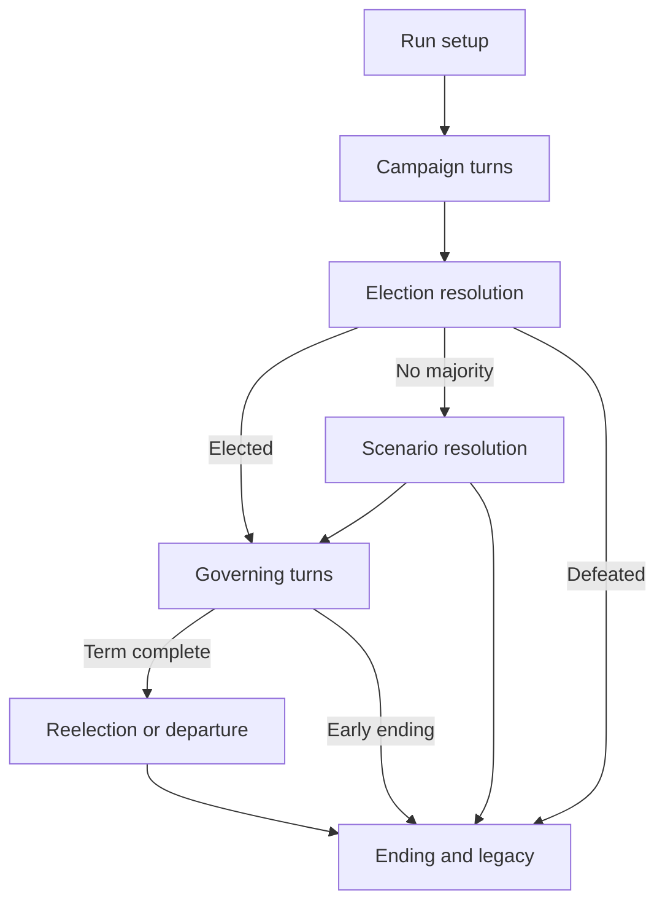

# Architecture and game design

## Decision

Keep the text implementation in Java, but make rules independent of console and Swing. Do not rewrite the whole project to build a map. Complete a short playable loop before selecting a permanent graphics stack.

## Engine boundaries

| Model/service | Purpose |
| --- | --- |
| `GameConfig` | Difficulty, seed, scenario identifier, rules version, candidate setup |
| `GameState` | Phase, turn, candidate, institutions, regions, resources, active events, history |
| `Candidate` | Identity, background, commitments, relationships; separate from office-specific state |
| `CampaignState` | Actions, campaign funds, staff, regional activity |
| `GovernmentState` | Public budget, appointments, pending decisions, institutional responses |
| `PlayerAction` | Typed command with parameters; validates eligibility and cost |
| `TurnResult` | New state, narrative, triggered events, available choices, ending if applicable |
| `ElectionOutcome` | Explicit player majority, opponent majority, or no majority |
| `EventDefinition` | Identifier, eligibility, choices, effects, cooldown, follow-up identifiers |
| `SaveRepository` | Versioned serialization, migration, backup, error handling |

Avoid one expanding `President` class containing the entire game. Separate candidate properties from public conditions and institutional state. Separate private campaign money from the public treasury. Each resource needs a documented unit and purpose.

## Phase transitions

In the text alpha, reelection resolves to an epilogue. Later releases may transition into a second term or an alternate fictional political system. Keep transition rules explicit and testable.

## Turn lifecycle

Validate action and phase; reserve costs; apply direct effects; resolve eligible consequences and events; advance time; check ending conditions; return narrative and available actions. Commit the entire result atomically. A failed validation must not partially change the game.

Immediate choice text should communicate tradeoffs. Follow-up text should explain observable consequences. Distinguish player knowledge from internal game state so a UI does not accidentally expose hidden events.

## Randomness and saves

Use one engine-owned random source passed through services. Record seed, action history, rules version, and content version. A seed alone cannot resume a run if earlier draws have already been consumed: either persist the generator state through an explicit supported mechanism or reconstruct it using deterministic replay. Prefer replay for the first small engine.

Use a versioned JSON save schema rather than arbitrary Java object deserialization. Save at stable turn boundaries using a temporary file and atomic replacement where supported. Preserve the previous valid save if a write fails. Validate imported data before altering the active game. Cap file size and content collection sizes.

Initially promise compatibility only within a documented save-schema version. Add migrations deliberately. Pin event ordering and content identifiers so replay does not change when file ordering changes.

## Content model

Start with data-only events: stable ID, phase, prerequisites, weight, cooldown, narrative, choices, costs, effects, follow-ups, and tags. Validate references and allowed effect names at load time. Keep scripted effects in a small registry controlled by the engine.

Initial mods should be declarative scenario and event files, not executable plugins. Add a schema and useful validation errors before a visual scenario editor. Keep scenarios versioned so a saved run can identify the content it requires.

## From console to GUI

The GUI should provide a map overview, selectable regional detail, current resources, event cards, a decision panel, and a timeline. Keep the core decision loop readable on smaller screens. Include keyboard navigation, scalable text, labeled outcomes, and color-independent state distinctions.

| Delivery option | Benefit | Cost | Suggested use |
| --- | --- | --- | --- |
| Java desktop UI over the same engine | Direct reuse; offline play; no game server | Installation and desktop distribution; web ads are awkward | Best if completing a downloadable game is the priority |
| Browser UI with a Java engine API | Reuses rules; easy link sharing; web ad surface | Server costs, sessions, network failures, abuse controls | Prototype if hosted advertising becomes a firm requirement |
| Browser-local engine port | Offline-capable and low server cost | Porting and maintaining rule parity | Consider only after stable rules and measured API costs |

Recommended sequence: Java engine and console, then one browser proof of concept that renders a turn, submits a choice, and reloads a save. Compare effort and costs with a desktop proof of concept before committing. Do not operate two independent rule implementations during alpha.

For a server-backed game, validate all commands on the server, isolate sessions, set expiration limits, rate-limit requests, and avoid collecting unnecessary personal data. Keep anonymous local runs as the default where feasible. Account and multiplayer systems are deferred.

## Fictional institutional dynamics

Build basic governing before alternate trajectories. Model institutional reactions, relationships, legitimacy, and public consequences within the fictional scenario. Use authored event chains with prerequisites and countervailing outcomes. Do not attach ideological judgments or electability rankings to real politicians or parties.

A constitutional scenario should explicitly identify factual rules; fictional exceptions should be labeled alternate history. This distinction is especially relevant for term limits and election resolution. Use primary constitutional sources when implementing those rules rather than treating game mechanics as legal explanations.
